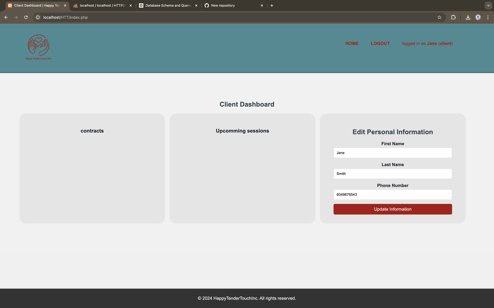
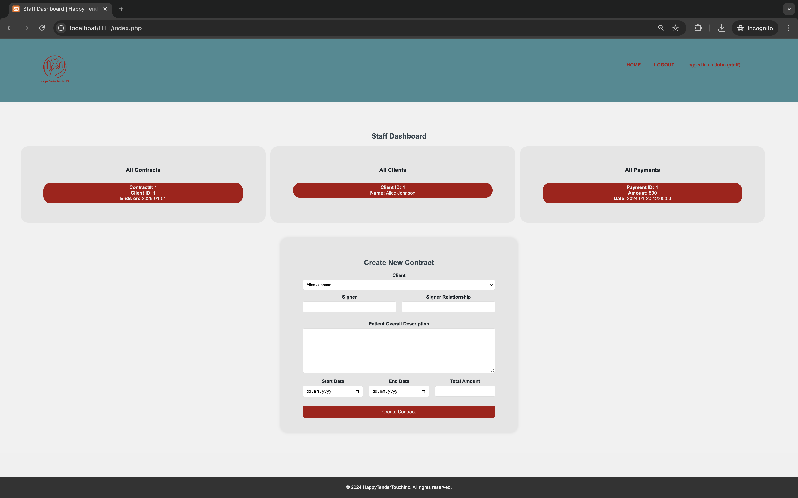

# CPSC2221-Database Systems Group 11 -- Group Project Part V

**IMPORTANT NOTE:** This project is developed for educational purposes and does not meet real-world production qualifications.

**_Note to the Marker_**
Due to time limitations, not all written queries were used in the project. For complete queries, please check the classes in the models directory.

## Overview

This project represents the final submission for Group 11's assignment in the Summer 2024 CPSC2221-Database Systems Courseware. It showcases an imaginary home care company application.

_Client Dashboard Screenshot_

_Staff Dashboard Screenshot_

## Copyright

MVC Framework by Parsa Hamidian

## Authors (Group Members)

Parsa Hamidian
Avery Allan-McKay
Kanishka Pal

## Dummy Usernames and Passwords

- **Client Role:**
  - Username: `client`
- **Staff Role:**
  - Username: `staff`
- **Password for all dummy accounts:** `1234`

## Instructions to Run

### Automated Setup (UNIX OS)

To set up the dummy database on UNIX-based operating systems, execute the following script in the setup directory:

bash
./setupDatabase.auto.bash

### Manual Setup

To set up the dummy database manually, run the two SQL files located in the setup directory against your MySQL database. Use the following commands:

mysql -u <mysql_username> -p < setup/setup.sql
mysql -u <mysql_username> -p < setup/dummyData.sql

License
This project is licensed under the terms of the MIT license.

## Project private repository:

https://github.com/Phranson/HappyTenderTouch
